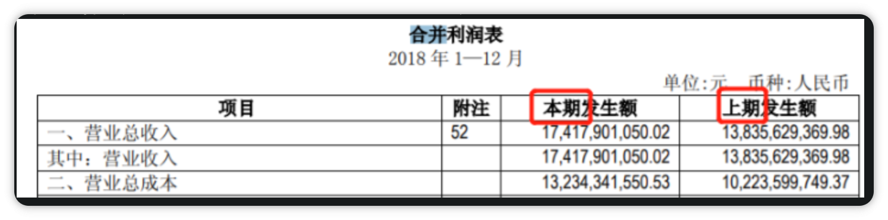
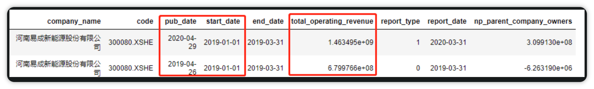

# 股票——报告期财务数据常见问题

## 常见数据问题>>>

报告期数据中为什么有"重复的数据"？
A:您指的"重复的数据"应该指的是公司披露本季度财务数据同时披露的往期的财务数据 , 一般为去年同期,抑或有对之前披露过的财务信息批量调整公告,(上市公告书,招募说明书中会披露过去近几年的财务数据,可以使用source_id字段进行判断)。 可以使用end_date(统计截止日期) 和 report_type ( 0:本期,1:非本期,一般为上年同期 ) 进行区分和过滤。


例如300080在2020-04-29发布的2019Q1数据为调整数据 , 2019-04-26 发布的2019Q1数据为本期数据

```python
q = query(finance.STK_INCOME_STATEMENT.company_name,
finance.STK_INCOME_STATEMENT.code,
finance.STK_INCOME_STATEMENT.pub_date,
finance.STK_INCOME_STATEMENT.start_date,
finance.STK_INCOME_STATEMENT.end_date,
finance.STK_INCOME_STATEMENT.total_operating_revenue,
          finance.STK_INCOME_STATEMENT.report_type,
          finance.STK_INCOME_STATEMENT.report_date,
finance.STK_INCOME_STATEMENT.np_parent_company_owners).filter(
    finance.STK_INCOME_STATEMENT.code == '300080.XSHE',
    finance.STK_INCOME_STATEMENT.end_date == '2019-03-31', ).limit(2)
df = finance.run_query(q)
df.sort_values(by=['pub_date'])
```
2、上市公司的财报如果后来有修改(修正),请问是怎么处理的？get_fundamentals是怎么处理有修改的财务数据。有的使用修复前的,有的使用修改后的？报告期又是怎样的规则

A:(1)上市公司财报更新前和更新后的数据,为了避免未来函数(当前时间取到未来数据),理论上要保留同一报告期的所有版本,目前受数据源的限制,这块处理规则是按最新更新的(部分比较久远的数据可能会用第一个版本);

(2)公司新发布一期财报,一般同时会给出上一年度同期的调整财报,对于这种情况相隔时间较久的情况(半年以上),我们单季度数据一般不再对老的财报进行更新;而有时候,公司会在短期内(半年内或者1个月内)对前段时间更新的财报进行调整, 这种情况我们单季度数据也会采用修正后的财报;

(3)上面的规则主要是针对单季度财务数据的。报告期财务数据中,如果公司是在之后的某一季度修正的财报,覆盖维护后会保留本期和上期数据 ;pub_date披露时间按第一次披露时间



